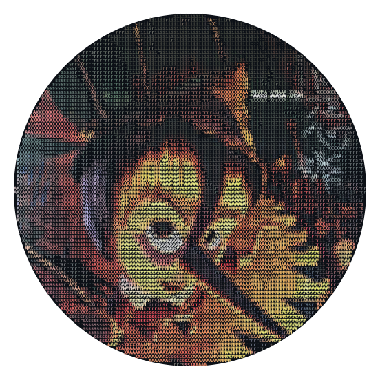

  

# Hi, I'm Junwei 👋

I'm a Computer Science undergraduate at NYU. I build tools that make complex information easier to play on, especially for PEOPLE's uses.

### Selected work

- **[Hermesruns](https://github.com/JunWeiLi233/Hermesruns)** — A local-first running website that brings training history, readiness, and shoe tracking together. `React · Spring Boot`
- **[Better Albert](https://github.com/JunWeiLi233/NYU-Albert-UI-Redesign)** — A browser extension that helps students navigate NYU Albert while keeping official actions in Albert. `TypeScript · Manifest V3`
- **[Bilibili User Personality](https://github.com/JunWeiLi233/Bilibili-User-Personality)** — A research prototype that studies public-comment behavior through an interpretable six-dimension framework. `JavaScript · Python`

### More things I've built

[Albert RMP Ratings](https://github.com/JunWeiLi233/NYU-Professor-RMP-Rating) ·
[Hermesruns iOS](https://github.com/JunWeiLi233/Hermesruns-ios) ·
[Strava Auto Kudos](https://github.com/JunWeiLi233/strava-auto-kudos)

### Tools I use

React, TypeScript, JavaScript, Java, Spring Boot, Python, Swift, and browser extensions.

### Contact Me

Email me: mcpejunwei@gmail.com
Question? I am always here to help!
Working together for a project? Always welcome!!!
Networking? Hell yeah, drop me an email.
